  

  Backend-focused full-stack developer building applications with relational data, real-time features, external APIs, automated testing and production delivery.

  <code>C#</code>&nbsp; · &nbsp;<code>ASP.NET Core</code>&nbsp; · &nbsp;<code>Entity Framework Core</code>&nbsp; · &nbsp;<code>SQL Server</code>&nbsp; · &nbsp;<code>PostgreSQL</code>&nbsp; · &nbsp;<code>JavaScript / TypeScript</code>&nbsp; · &nbsp;<code>Docker</code>&nbsp; · &nbsp;<code>GitHub Actions</code>

---

## Selected Engineering Work

### 01 — DentalClinic
PRIMARY PROJECT · FULL-STACK WEB PLATFORM

ASP.NET Core dental-clinic platform covering public booking, patient/admin workflows, real-time updates and AI-assisted support.

- Layered REST backend with **EF Core + SQL Server**, migrations, indexing and relational data modelling.
- **JWT + BCrypt** authentication for patient/admin roles, plus rate limiting, CORS and centralized error handling.
- **SignalR** notifications and background jobs for appointment/reminder and stale-request workflows.
- **Gemini** chat/translation and **ElevenLabs** TTS integrations with explicit secret-handling boundaries.
- **xUnit**, GitHub Actions, CodeQL and Docker-based deployment tooling.

`ASP.NET Core 10` `EF Core 10` `SQL Server` `SignalR` `JWT` `Docker`

&nbsp;&nbsp;

---

### 02 — FleetManagement
DESKTOP BUSINESS APPLICATION

Windows fleet-management application for drivers, vehicles, routes and role-aware operational workflows.

- **C# / WPF** desktop application targeting **.NET Framework 4.7.2**.
- **Entity Framework 6 + SQL Server** persistence with a relational fleet model.
- Dedicated authentication, driver, route and vehicle service layers with admin/client navigation paths.
- **MSTest** coverage for core service logic.

`C#` `WPF` `.NET Framework 4.7.2` `EF6` `SQL Server` `MSTest`

---

### 03 — Smart Route Planner
GEOSPATIAL · ALGORITHMS · ML

Map-first route planner combining real-road routing, optimization algorithms, custom machine learning and resilient external-service integrations.

- **OSRM** road routing with caching/failover plus Haversine, Nearest Neighbor and **2-opt** fallbacks/optimization.
- From-scratch **MLP + backpropagation**, softmax classification and **K-Means** day-plan clustering in PHP.
- **MapLibre GL JS + OpenFreeMap**, Overpass POI data and Open-Meteo weather integration.
- Unit/HTTP tests, **Playwright** product flows, multi-version PHP CI, production smoke checks and automated Docker builds.

`PHP 8.3` `MapLibre GL JS` `OSRM` `ML` `Playwright` `Docker`

&nbsp;&nbsp;

---

  <strong>Resume</strong> 
  Full background, education, languages and contact details.
    
  
    
  C# · APIs · Data · Delivery

