  &nbsp;
  

  

  Full-stack .NET разработчик с фокусом на backend: реляционные данные, real-time функциональность, внешние API, автоматизированное тестирование и production-доставка.

  <code>C#</code>&nbsp; · &nbsp;<code>ASP.NET Core</code>&nbsp; · &nbsp;<code>Entity Framework Core</code>&nbsp; · &nbsp;<code>SQL Server</code>&nbsp; · &nbsp;<code>PostgreSQL</code>&nbsp; · &nbsp;<code>JavaScript / TypeScript</code>&nbsp; · &nbsp;<code>Docker</code>&nbsp; · &nbsp;<code>GitHub Actions</code>

  

## Избранные инженерные проекты

### 01 — DentalClinic
ОСНОВНОЙ ПРОЕКТ · FULL-STACK WEB PLATFORM

Платформа стоматологической клиники на ASP.NET Core: публичная онлайн-запись, кабинеты пациента и администратора, real-time обновления и AI-функциональность.

- Многоуровневый REST backend на **EF Core + SQL Server**: миграции, индексы и реляционное моделирование данных.
- Аутентификация **JWT + BCrypt** для ролей пациента и администратора; rate limiting, CORS и централизованная обработка ошибок.
- **SignalR** для уведомлений в реальном времени и фоновые процессы для напоминаний и обработки заявок.
- Интеграции **Gemini** для чата/перевода и **ElevenLabs** для TTS с отдельной обработкой секретов.
- **xUnit**, GitHub Actions, CodeQL и Docker-инструменты для сборки и доставки.

`ASP.NET Core 10` `EF Core 10` `SQL Server` `SignalR` `JWT` `Docker`

&nbsp;&nbsp;

---

### 02 — FleetManagement
DESKTOP BUSINESS APPLICATION

Windows-приложение для управления автопарком: водители, транспорт, маршруты и рабочие процессы с разграничением ролей.

- Desktop-приложение на **C# / WPF** для **.NET Framework 4.7.2**.
- Хранение данных через **Entity Framework 6 + SQL Server** с реляционной моделью автопарка.
- Отдельные сервисы для аутентификации, водителей, маршрутов и транспорта; разные пользовательские сценарии для администратора и клиента.
- **MSTest** для проверки основной сервисной логики.

`C#` `WPF` `.NET Framework 4.7.2` `EF6` `SQL Server` `MSTest`

---

### 03 — Smart Route Planner
ГЕОДАННЫЕ · АЛГОРИТМЫ · ML

Map-first планировщик маршрутов, объединяющий дорожную маршрутизацию, алгоритмы оптимизации, собственные ML-реализации и устойчивые интеграции с внешними сервисами.

- Маршрутизация через **OSRM** с кэшированием и failover; Haversine, Nearest Neighbor и **2-opt** для fallback/оптимизации.
- Реализованные с нуля **MLP + backpropagation**, softmax-классификация и **K-Means** для разбиения поездки по дням на PHP.
- **MapLibre GL JS + OpenFreeMap**, данные POI через Overpass и погода через Open-Meteo.
- Unit/HTTP тесты, **Playwright** product-flow тесты, CI для нескольких версий PHP, production smoke checks и автоматическая сборка Docker-образов.

`PHP 8.3` `MapLibre GL JS` `OSRM` `ML` `Playwright` `Docker`

&nbsp;&nbsp;

---

  <strong>Резюме</strong> 
  Полная информация об опыте, образовании, языках и контактах.
    
  
    
  C# · API · Data · Delivery

